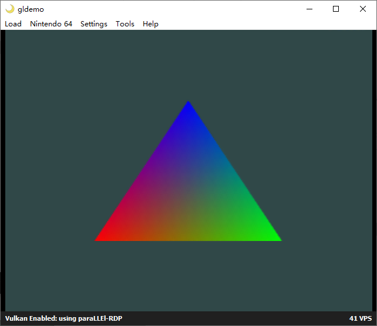

# N64_helloworld



A basic N64 demo

# Config libdragon toolchain & SDK

1. download [toolchain in .deb format](https://github.com/DragonMinded/libdragon/releases/download/toolchain-continuous-prerelease/gcc-toolchain-mips64-x86_64.deb) or [toolchain in .rpm format](https://github.com/DragonMinded/libdragon/releases/download/toolchain-continuous-prerelease/gcc-toolchain-mips64-x86_64.rpm) and install.
    ```bash
    # default install path /opt/libdragon
    sudo dpkg -i gcc-toolchain-mips64-x86_64.deb
    ```
2. config environment variable `N64_INST`
    ```bash
    export N64_INST=/opt/libdragon
    ```
3. download and install libdragon sdk
    ```bash
    # only preview branch has openGL 1.1 and Tiny3D support
    git clone -b preview https://github.com/DragonMinded/libdragon.git
    ```

# Referencs
- https://libdragon.dev/
- https://github.com/DragonMinded/libdragon/tree/preview
- https://github.com/DragonMinded/libdragon/wiki/Installing-libdragon
- https://github.com/DragonMinded/libdragon/tree/preview/examples
- [ares-emulator](https://github.com/ares-emulator/ares)
